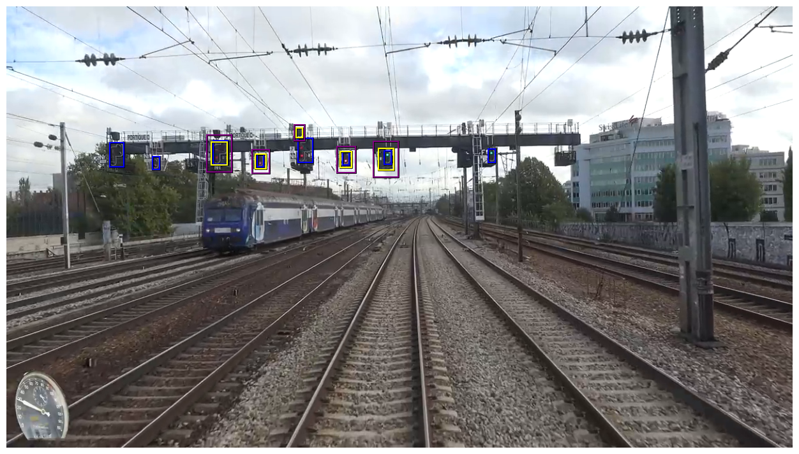

# Confident Object Detection via Conformal Prediction and Conformal Risk Control: an Application to Railway Signaling
Link to the preprint on [ArXiv](https://arxiv.org/abs/2304.06052), submitted to COPA 2023.

The code to reproduce experiments is in the notebook, and is based on a small purpose-built library for conformal object detection.

The dataset used in our experiments will be published soon separately, and other datasets can be tested easily using our code. The dataset is however not required as all necessary data is provided in the pickle on the google drive.

## Instructions
We run the experiments under Ubuntu 22.04 with the Yolov5 pretrained network, as others require more care (details in further sections).
1. Clone the repository `git clone git@github.com:leoandeol/conformal_railway_signal_detection.git && cd conformal_railway_signal_detection`
2. Install detectron2 following [its documentation](https://detectron2.readthedocs.io/en/latest/tutorials/install.html)
3. Install the requirements `pip install -r requirements.txt`
4. Create a "preds" folder `mkdir preds` and place the predictions of the desired model inside, which can be downloaded [here](https://drive.google.com/drive/folders/1L2slQp4c_JcysTbtR7KNn2zfjCElmj07?usp=share_link)
5. Run the notebook

## Future work
* Lower memory usage of DETR
* Pack DiffusionDet in a self-contained way 
* Add more pretrained models, and finetuned models
* Plot best and worst images
